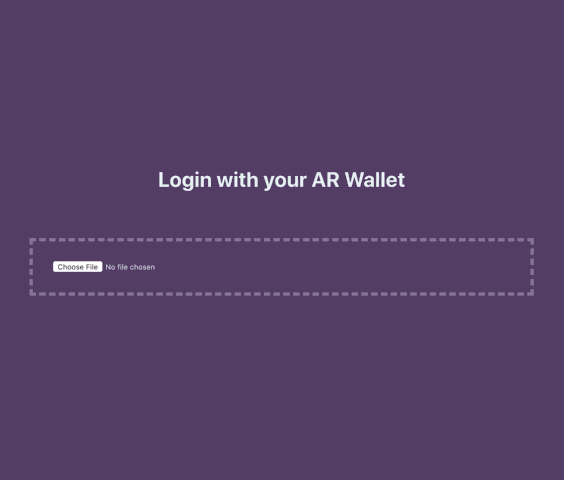

## Project 4-2019

# arweave canvas draw

## 1. Description 

Login with your AR wallet and paint on Canvas Draw. Simple painting app, minimal viable product. 



Live example at: [https://arweave.net/iERxf7S9wvoIP5KCREh6dxeHahM2zVkurNcbkNx3B50](https://arweave.net/iERxf7S9wvoIP5KCREh6dxeHahM2zVkurNcbkNx3B50)

See it in Arweave Apps: [https://arweave.net/35IFq9BcIgpSPti9YDYDiaQy4wMfMIKZ25t7hHZrhek](https://arweave.net/35IFq9BcIgpSPti9YDYDiaQy4wMfMIKZ25t7hHZrhek)

## 2. Getting Started

Install dependencies within client.

```
cd client
yarn

```

Start the project.

```
yarn start

```


## 3. AR Weave Deploy

### 2.2 Ready the build

Install dependencies and build the project.

```
cd client
yarn
yarn build
```

This build is made to compile an `index.html` file made for relative, instead of a server, file dependency paths. To reset it to default, remove the `homepage` property inside of `package.json`.

The Arweave CLI will not package images into a single upload. To include images, upload the image files separately on Arweave then link, or link to your externally hosted images such as uploading your images to https://imgur.com. 

### 2.3 Ready your AR account

Create an AR wallet with AR. Wallet creation address is [https://tokens.arweave.org/](https://tokens.arweave.org/). This should provide you with a json file. 

### 2.4 Install the AR CLI

Install the CLI

```
npm install -g arweave-deploy
```

### 2.5 Use the AR CLI to Deploy your build

Load your AR json wallet file to the AR CLI.

```
arweave key-save path/to/arweave-key.json
```

Now you can run deploy commands without passing your key each time. 


Test packaging your React app build.

```
arweave package path-to/index.html packaged.html
```

If packaged.html renders as intended, deploy to the AR permaweb. 

```
arweave deploy path-to-my/index.html --package
```

Example deployment found here: [https://arweave.net/0zw_3VA0vRWHBeaJ8KKPcxPaHvYj61id3eMOg6tsFcI](https://arweave.net/0zw_3VA0vRWHBeaJ8KKPcxPaHvYj61id3eMOg6tsFcI)
